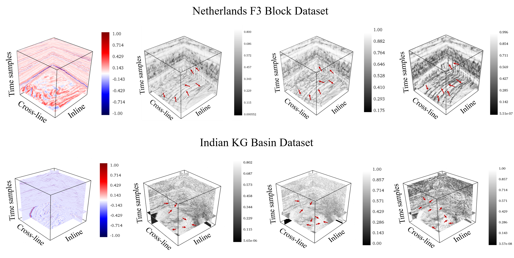

# Fast and Parallel Coherence Algorithms for Fault Detection in Large Seis-
mic Volumes: A CUDA-based Implementation


This repository contains the source code to perform CUDA implementation of coherence algorithm and evaluation on test data.




# Contents 

* "Scipts" folder contains python programs of CUDA enabled coherence algorithms for fault detection. 
* "Data" folder contains data named as "test_data.npy" which is requied to execute the algorithms. 
* "Output" folder is requied to save the results. 

## Data
Please download the data from the following link : https://drive.google.com/file/d/1MmuCt4bT4d6QFn7uhl9qDoAT_tA9sJvN/view?usp=sharing

## Setup

## prerequisites

* Windows
* NVIDIA GPU + CUDA enbled 
* Anaconda Navigator 
* Spyder 

## Getting Started 

* Install CUDA in your machine.
Link : https://docs.anaconda.com/anaconda/user-guide/tasks/gpu-packages/

* Install CUDA Toolkit. 
Link : https://docs.nvidia.com/cuda/cuda-toolkit-release-notes/index.html

## Python Packages 

The code has been tested using packages of:

* pip install numpy==1.19.3
* pip install scipy==1.7.1
* pip install vtk==9.1.0
* pip install mayavi==4.8.0
* pip install numba==0.55.2

## Running  the scripts


To execute the scripts please  follow the steps:


> * Download the codes from the repository. 
> * Open the python codes from scripts folder in Spyder. 
> * Run CUDA_semblance.py to execute CUDA enabled semblance coherence algorithm. 
> * Run CUDA_EigenStructure.py to execute CUDA enabled Eigen-Structure coherence algorithm.  
> * Run CUDA_GradientStructureTensor.py to execute CUDA enabled Gradient Structure Tensor coherence algorithm. 
> * The results will be saved in the folder "output\\" in '.npy' array format. 

# License

MIT License

Copyright (c) 2022 Ratul-1997

Permission is hereby granted, free of charge, to any person obtaining a copy
of this software and associated documentation files (the "Software"), to deal
in the Software without restriction, including without limitation the rights
to use, copy, modify, merge, publish, distribute, sublicense, and/or sell
copies of the Software, and to permit persons to whom the Software is
furnished to do so, subject to the following conditions:

The above copyright notice and this permission notice shall be included in all
copies or substantial portions of the Software.

THE SOFTWARE IS PROVIDED "AS IS", WITHOUT WARRANTY OF ANY KIND, EXPRESS OR
IMPLIED, INCLUDING BUT NOT LIMITED TO THE WARRANTIES OF MERCHANTABILITY,
FITNESS FOR A PARTICULAR PURPOSE AND NONINFRINGEMENT. IN NO EVENT SHALL THE
AUTHORS OR COPYRIGHT HOLDERS BE LIABLE FOR ANY CLAIM, DAMAGES OR OTHER
LIABILITY, WHETHER IN AN ACTION OF CONTRACT, TORT OR OTHERWISE, ARISING FROM,
OUT OF OR IN CONNECTION WITH THE SOFTWARE OR THE USE OR OTHER DEALINGS IN THE
SOFTWARE.


```python

```
